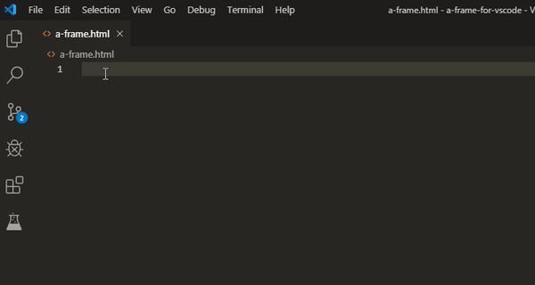

# A-Frame for VSCode

Adds A-Frame primitives to completion list and more.

## Features
1. Adds A-Frame primitives (a-box, a-sphere ...) to vscode completion list
2. Adds primitive and its attrbitues docs description

## Usage

## Change Log
See Change Log [here](CHANGELOG.md)

## Issues
Submit the [issues](https://github.com/pasalog/a-frame-for-vscode/issues) if you find any bug or have any suggestion.

## Contribution
Fork the [repo](https://github.com/pasalog/a-frame-for-vscode) and submit pull requests.
